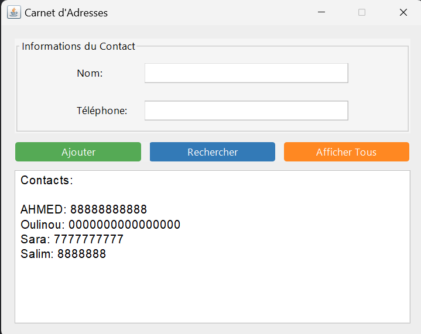

# Carnet d'Adresses (Contact Manager)

Carnet d'Adresses is a simple contact management application built using Java RMI (Remote Method Invocation) and Swing for the graphical user interface.

## Features

- Add contacts with name and phone number
- Search for contacts by name
- Display a list of all contacts

## Screenshots




## Getting Started

1. Ensure you have Java JDK 11 or above installed.
2. Compile the Java files:
   ```
   javac *.java
   ```
3. Start the RMI server:
   ```
   java ServeurRMI
   ```
4. Run the client GUI:
   ```
   java CarnetAdresseGUI
   ```

## Usage

- Enter a contact's name and phone number, then click "Ajouter Contact" to add a new contact.
- Enter a contact's name in the "Nom" field, then click "Rechercher Contact" to search for the contact.
- Click "Afficher Tous" to display a list of all contacts.


